# CHƯƠNG 3: CÁC YÊU CẦU CHỨC NĂNG

---

## 3.1 Biểu đồ lớp thực thể

### 3.1.1 Biểu đồ tổng quan (Core Entities)

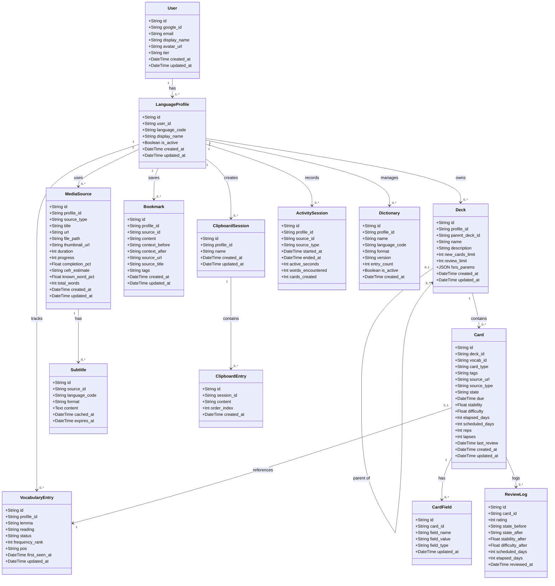

### 3.1.2 Mô tả từng lớp thực thể

| Tên lớp | Thuộc tính chính | Mô tả |
|---|---|---|
| **User** | id, google_id, email, tier | Tài khoản người dùng, xác thực qua Google OAuth. Tier xác định quyền truy cập (free/premium). |
| **LanguageProfile** | user_id, language_code, is_active | Hồ sơ học ngôn ngữ. Mỗi user có thể có nhiều profile cho các ngôn ngữ khác nhau. |
| **VocabularyEntry** | profile_id, lemma, status, frequency_rank | Từ vựng được theo dõi. Status: unknown → seen → learning → known → ignored. |
| **Deck** | profile_id, parent_deck_id, fsrs_params | Bộ thẻ flashcard. Hỗ trợ cấu trúc cây (deck con). Mỗi deck có cấu hình FSRS riêng. |
| **Card** | deck_id, vocab_id, state, due, stability | Thẻ flashcard. Lưu trạng thái FSRS (New/Learning/Review/Relearning) và ngày ôn tập tiếp theo. |
| **CardField** | card_id, field_name, field_value, field_type | Các trường nội dung của card (front, back, audio, image, sentence, v.v.). |
| **ReviewLog** | card_id, rating, state_before, state_after | Lịch sử mỗi lần ôn tập. Lưu rating (Again/Hard/Good/Easy) và thay đổi trạng thái FSRS. |
| **MediaSource** | profile_id, source_type, url, file_path | Nguồn media (YouTube, Netflix, podcast, file local). Lưu tiến độ xem và ước tính CEFR. |
| **Subtitle** | source_id, language_code, content, expires_at | Subtitle của media source. Cache 3 ngày, tự động expire. Hỗ trợ SRT/VTT/JSON. |
| **Bookmark** | profile_id, source_id, content, context | Đoạn văn/câu được đánh dấu từ trang web hoặc media. Lưu ngữ cảnh trước/sau. |
| **ClipboardSession** | profile_id, name | Phiên clipboard để gom nhóm các đoạn text copy từ nhiều nguồn. |
| **ClipboardEntry** | session_id, content, order_index | Một mục trong clipboard session. Có thứ tự để sắp xếp lại. |
| **ActivitySession** | profile_id, source_id, active_seconds | Phiên hoạt động học tập. Theo dõi thời gian thực tế, số từ gặp, số card tạo. |
| **Dictionary** | profile_id, name, language_code, format | Từ điển offline (StarDict/MDIC/JSON). Mỗi profile có thể có nhiều từ điển. |

---

## 3.2 Biểu đồ hoạt động

### 3.2.1 Biểu đồ hoạt động — Onboarding lần đầu (UC01.1)

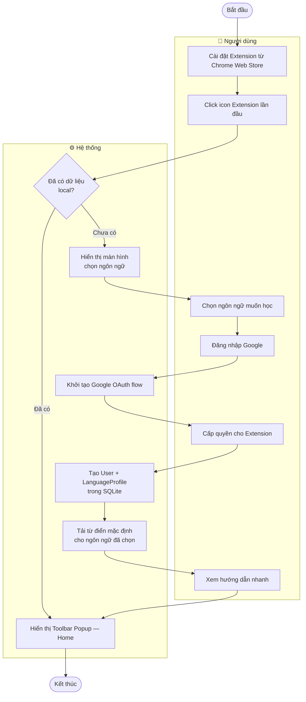

### 3.2.2 Biểu đồ hoạt động — Đọc trang web & Highlight từ vựng (UC03.1)

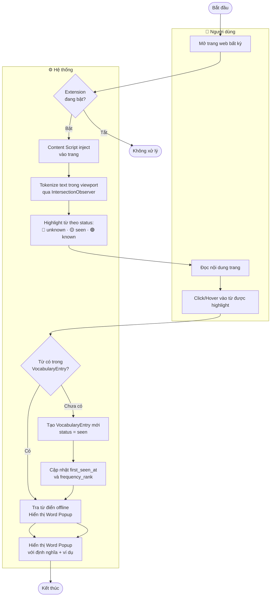

### 3.2.3 Biểu đồ hoạt động — Tạo Flashcard (UC09.2)

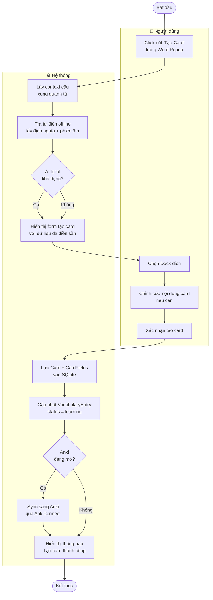

### 3.2.4 Biểu đồ hoạt động — Ôn tập SRS Ocean Memory (UC12.3)

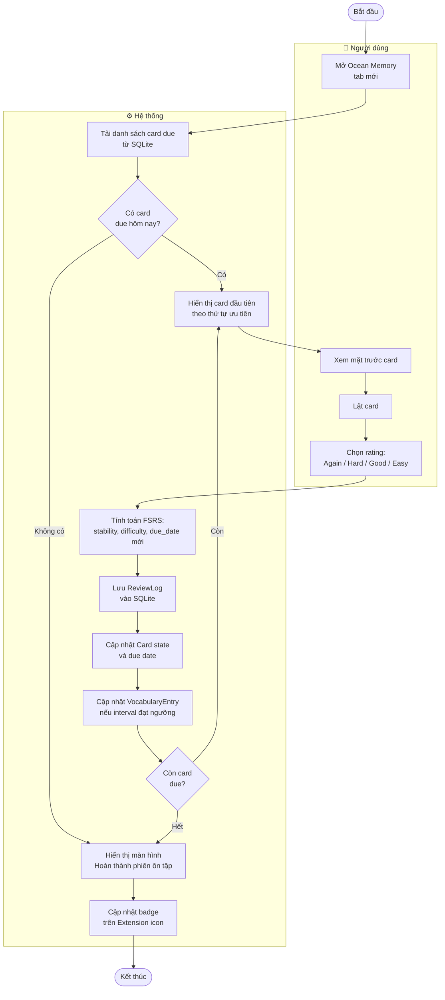

### 3.2.5 Biểu đồ hoạt động — Xem video với subtitle (UC04.1 + UC04.6)

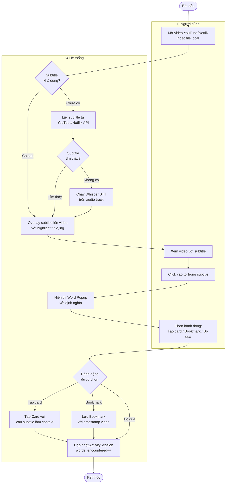

### 3.2.6 Biểu đồ hoạt động — Sync Google Drive (UC15.1)

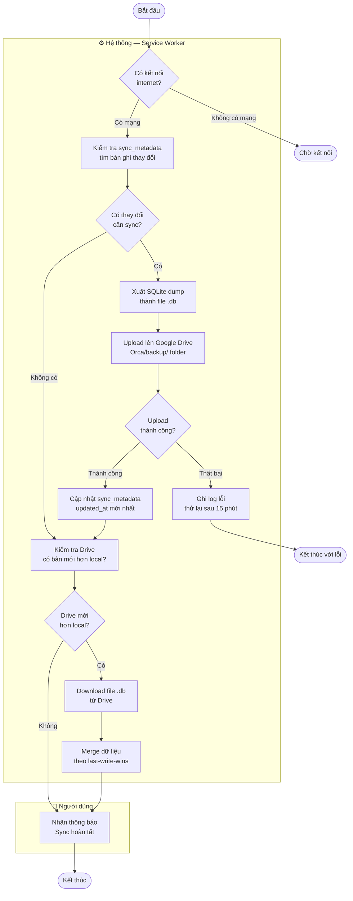

---

## 3.3 Biểu đồ Swimlane

### 3.3.1 Swimlane — Quy trình tạo Flashcard từ Video

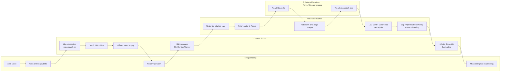

### 3.3.2 Swimlane — Quy trình Onboarding & Đăng nhập

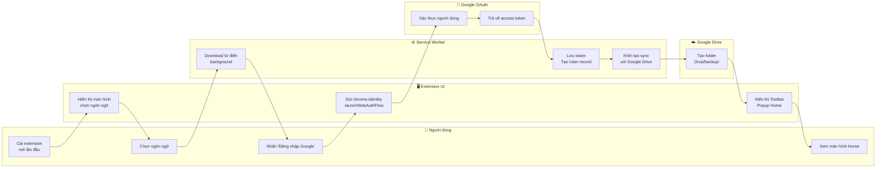

### 3.3.3 Swimlane — Quy trình Ôn tập SRS & Sync

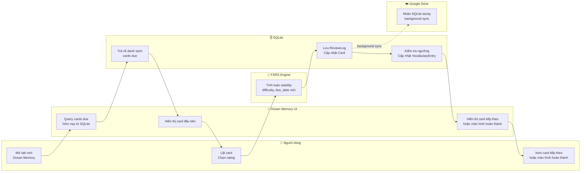

---

## 3.4 Yêu cầu của hệ thống

### 3.4.1 Screen Flow

#### Luồng điều hướng tổng thể

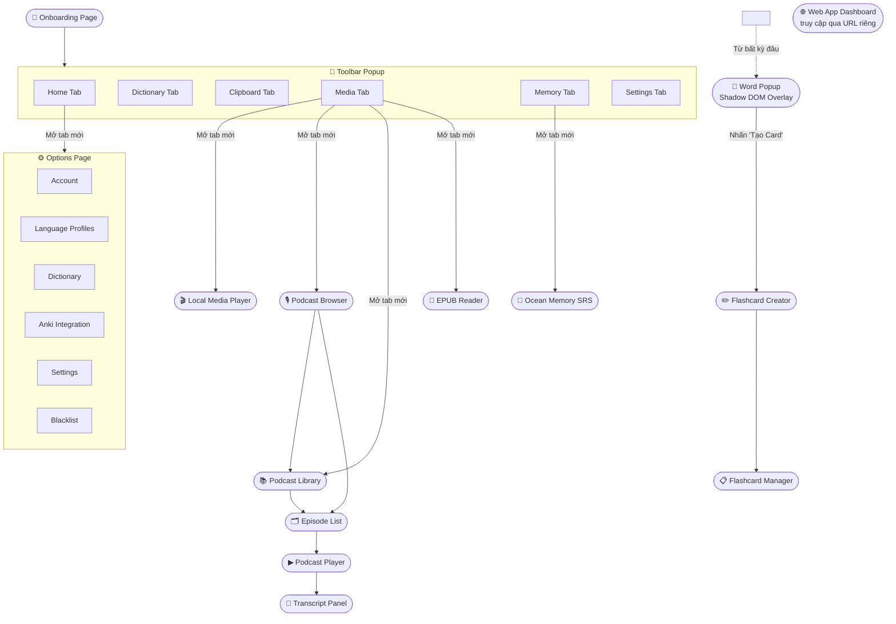

#### Video Subtitle Flow

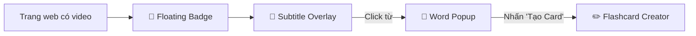

### 3.4.2 Screen Descriptions

| # | Màn hình | Mô tả | Kích thước | Điểm vào |
|---|---|---|---|---|
| 1 | **Onboarding Page** | Màn hình chào mừng khi cài extension lần đầu. Cho phép chọn ngôn ngữ học, theo dõi tiến trình download từ điển, và đăng nhập Google để bật sync. | Tab toàn màn hình | Tự động mở sau khi cài extension |
| 2 | **Toolbar Popup — Home** | Tab mặc định của popup. Hiển thị thống kê học tập hôm nay (cards due, streak, thời gian học), lịch sử tra từ gần đây, và các quick action (tra từ nhanh, mở Ocean Memory). | 380×520px | Click icon extension trên toolbar |
| 3 | **Toolbar Popup — Dictionary** | Tab tra từ thủ công. Người dùng nhập từ vào ô tìm kiếm, hệ thống trả về định nghĩa từ tất cả từ điển đang bật, kèm audio phát âm và ví dụ câu. | 380×520px | Tab Dictionary trong Toolbar Popup |
| 4 | **Toolbar Popup — Clipboard** | Tab quản lý clipboard. Cho phép paste đoạn văn bản, phát TTS, highlight từ vựng trong đoạn text, và lưu thành named session để xem lại sau. | 380×520px | Tab Clipboard trong Toolbar Popup |
| 5 | **Toolbar Popup — Media** | Tab danh sách nguồn media. Hiển thị lịch sử video/podcast/file đã xem, tiến độ xem, và ước tính CEFR. Cho phép mở lại hoặc xóa khỏi danh sách. | 380×520px | Tab Media trong Toolbar Popup |
| 6 | **Toolbar Popup — Memory** | Tab tổng quan SRS. Hiển thị số card due hôm nay, streak hiện tại, biểu đồ mini forecast 7 ngày, và nút "Bắt đầu ôn tập" mở Ocean Memory. | 380×520px | Tab Memory trong Toolbar Popup |
| 7 | **Toolbar Popup — Settings** | Tab cài đặt nhanh. Cho phép bật/tắt highlight, chọn ngôn ngữ active, điều chỉnh trigger mode (click/hover), và truy cập Options Page đầy đủ. | 380×520px | Tab Settings trong Toolbar Popup |
| 8 | **Word Popup (Shadow DOM)** | Overlay tra từ xuất hiện khi click/hover vào từ được highlight. Hiển thị định nghĩa đa từ điển, audio phát âm, pinyin (ZH), AI giải thích on-demand, phân tích câu, và nút tạo flashcard. Lần đầu mở tab AI sẽ tự tải model theo RAM và hiển thị progress nhỏ trong popup. Cô lập hoàn toàn khỏi CSS trang web qua Shadow DOM. | 360×480px (floating) | Click/hover từ highlight trên trang web hoặc subtitle |
| 9 | **Floating Badge** | Badge nhỏ cố định góc trên phải trang web. Hiển thị % từ đã biết trên trang, số từ chưa biết, và ước tính CEFR. Nhấn để mở Floating Bar chi tiết hơn. | 120×40px | Tự động xuất hiện khi content script kích hoạt |
| 10 | **Floating Bar (expandable)** | Thanh mở rộng từ Floating Badge. Hiển thị phân tích chi tiết trang: phân bố từ theo status, danh sách từ chưa biết, câu i+1 được phát hiện, và tùy chọn ẩn/hiện highlight. | Toàn chiều rộng × 200px | Nhấn vào Floating Badge |
| 11 | **Ocean Memory SRS** | Màn hình ôn tập flashcard chính. Hiển thị card theo thứ tự FSRS, cho phép lật card và chọn rating (Again/Hard/Good/Easy). Có thanh tiến độ, daily goal, và màn hình tổng kết sau khi hoàn thành. | Tab toàn màn hình | Tab Memory → nút "Ôn tập", hoặc từ Home tab |
| 12 | **Flashcard Manager** | Màn hình quản lý toàn bộ flashcard. Hỗ trợ tìm kiếm theo từ/câu, lọc theo deck/trạng thái/ngày tạo, xem trước card, chỉnh sửa nội dung, và bulk actions (xóa, chuyển deck). | Tab toàn màn hình | Options Page hoặc link từ Home tab |
| 13 | **Vocabulary Manager** | Màn hình quản lý từ vựng đang theo dõi. Hiển thị danh sách lemma với status, frequency rank, POS, ngày thêm. Hỗ trợ lọc, tìm kiếm, đổi status thủ công, bulk actions, và import word list. | Tab toàn màn hình | Options Page |
| 14 | **Bookmark Manager** | Màn hình quản lý đoạn văn đã bookmark. Hiển thị nội dung bookmark kèm ngữ cảnh, nguồn (URL/media), tags, và ngày lưu. Hỗ trợ tìm kiếm, lọc theo tag, và xóa bookmark. | Tab toàn màn hình | Options Page |
| 15 | **Options Page — Account** | Trang thông tin tài khoản. Hiển thị avatar, tên, email, tier hiện tại, và thống kê tổng quan (tổng từ đã học, tổng card, streak dài nhất). Có nút nâng cấp lên Premium và đăng xuất. | Tab toàn màn hình | Options Page → sidebar Account |
| 16 | **Options Page — Dictionary** | Trang quản lý từ điển. Hiển thị danh sách từ điển đã cài (tên, ngôn ngữ, số entries, phiên bản). Cho phép thêm từ điển auto-download, import file Yomichan, ẩn/hiện, xóa, và cập nhật phiên bản. | Tab toàn màn hình | Options Page → sidebar Dictionary |
| 17 | **Options Page — Settings** | Trang cài đặt nâng cao. Quản lý keyboard shortcuts, chọn theme (sáng/tối/hệ thống), cấu hình AI local (model, RAM tier, endpoint fallback), cài đặt trigger mode, và tùy chỉnh hiển thị Word Popup. | Tab toàn màn hình | Options Page → sidebar Settings |
| 18 | **Local Media Player** | Trình phát video/audio file local với subtitle overlay tích hợp. Hỗ trợ SRT/VTT, highlight từ vựng trong subtitle, click từ để tra cứu, điều chỉnh tốc độ phát, và lưu tiến độ xem. | Tab toàn màn hình | Toolbar Popup → Media tab → mở file local |
| 19 | **Podcast Browser** | Màn tìm kiếm podcast theo tên, host hoặc keyword. Hiển thị card kết quả, cho phép xem nhanh metadata, lưu vào thư viện, và mở sang episode list. | Tab toàn màn hình | Toolbar Popup → Media tab → mở podcast |
| 20 | **Podcast Library** | Màn danh sách podcast đã lưu. Cho phép mở lại podcast đang nghe dở, ghim podcast yêu thích, xóa khỏi thư viện, và đi tới episode list. | Tab toàn màn hình | Toolbar Popup → Media tab → Library |
| 21 | **Episode List** | Màn chi tiết của một podcast. Hiển thị danh sách episode, thời lượng, mô tả ngắn, trạng thái tải, và nút phát / tải offline. | Tab toàn màn hình | Từ Podcast Browser hoặc Podcast Library |
| 22 | **Podcast Player** | Màn phát episode. Cung cấp play/pause, seek, skip, speed, loop, volume, subtitle sync, và resume progress. | Tab toàn màn hình | Từ Episode List hoặc resume episode |
| 23 | **Transcript Panel** | Panel câu trong Podcast Player. Hiển thị từng câu theo timestamp, highlight câu đang phát, click câu để seek, click từ để mở Word Popup, và lọc câu theo trạng thái. | Trong Podcast Player | Từ Podcast Player |
| 24 | **Web App Dashboard** | Ứng dụng web riêng biệt (truy cập qua URL). Hiển thị thống kê học tập nâng cao: biểu đồ retention theo thời gian, heatmap hoạt động, phân tích vocabulary growth, forecast SRS, và lịch sử review chi tiết. | Trình duyệt web đầy đủ | Truy cập trực tiếp qua URL web app |

### 3.4.3 Screen Authorization

| Screen | Guest | Free User | Premium User |
|---|---|---|---|
| Toolbar Popup — Home | X | X | X |
| Toolbar Popup — Dictionary | X | X | X |
| Toolbar Popup — Clipboard | X | X | X |
| Toolbar Popup — Media | | X | X |
| Toolbar Popup — Memory | | X | X |
| Toolbar Popup — Settings | X | X | X |
| Onboarding Page | X | | |
| Ocean Memory SRS (New Tab) | | X | X |
| Flashcard Manager | | X | X |
| Vocabulary Manager | | X | X |
| Bookmark Manager | | X | X |
| Options Page — Account | X | X | X |
| Options Page — Dictionary | | X | X |
| Options Page — Language Profiles | | X | X |
| Options Page — Settings | X | X | X |
| Options Page — Anki Integration | | X | X |
| Options Page — Blacklist | X | X | X |
| Local Media Player | | X | X |
| EPUB/PDF Reader | | X | X |
| Podcast Browser | | X | X |
| Podcast Library | | X | X |
| Episode List | | X | X |
| Podcast Player | | X | X |
| Transcript Panel | | X | X |
| Clipboard Tab | X | X | X |
| Web App Dashboard | | X | X |
| Word Popup (Shadow DOM) | X (hover) | X (click+hover) | X |
| Floating Badge | X | X | X |
| Video Subtitle Overlay | X | X | X |

### 3.4.4 Các chức năng không có giao diện

| # | Feature | System Function | Description |
|---|---|---|---|
| 1 | Sync | Drive Sync | Tự động sync SQLite dump + media lên Google Drive khi có mạng |
| 2 | Anki Sync | AnkiConnect Sync | Tự động sync 2 chiều khi Anki đang mở |
| 3 | FSRS Scheduling | Schedule Cards | Tính toán ngày ôn tập tiếp theo sau mỗi review |
| 4 | STT | Whisper Transcribe | Transcribe audio thành subtitle (batch + chunked) |
| 5 | Tokenizer | Tokenize Page | Tách từ text trên trang web theo viewport (IntersectionObserver) |
| 6 | Badge Update | Update Badge | Cập nhật số card due trên extension icon |
| 7 | Notification | Daily Reminder | Gửi Chrome notification nhắc ôn tập theo giờ cố định |
| 8 | Achievement | Daily Achievement | Gửi notification tổng kết thành quả học trong ngày |
| 9 | i+1 Detection | Detect i+1 Sentences | Phát hiện câu chỉ có 1 từ chưa biết trong viewport |
| 10 | Vocab Auto-Update | Auto Status Update | Tự động chuyển trạng thái từ khi FSRS interval đạt ngưỡng |
| 11 | Dictionary Update Check | Check Dict Version | Kiểm tra phiên bản từ điển mới định kỳ |
| 12 | Subtitle Cache | Cache Subtitles | Cache subtitle Whisper 3 ngày, tự động expire |

---

## 3.5 Thiết kế Prototype

Chi tiết luồng thao tác và bản đồ màn hình tổng thể được mô tả đầy đủ ở `chuong_5_luong_thao_tac_toan_he.md`.
